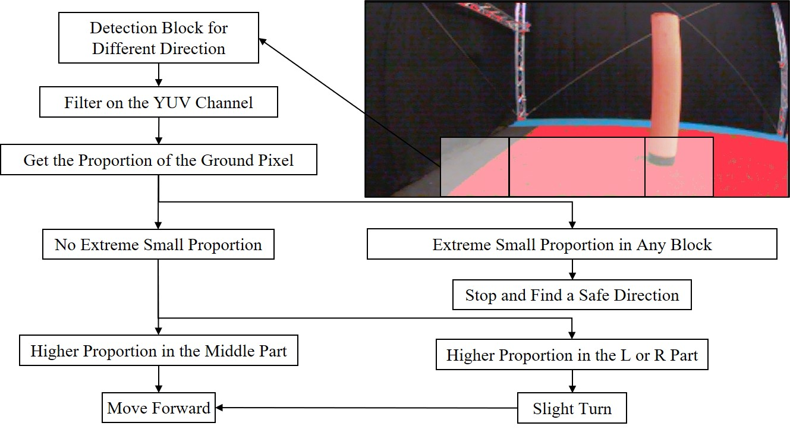
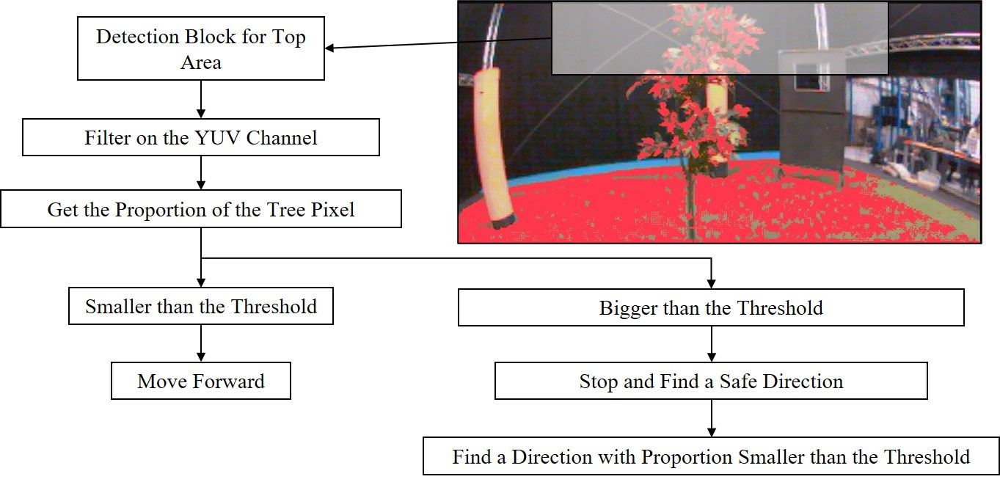

# README

Introduction
=============
This is the repository for Group 7 of the "AE4317 Autonomous Flights of MAVs" course, our primary challenge revolves around navigating in cluttered environments. Throughout the course, we've explored various techniques including edge detection, optic flow, and machine learning. However, we ultimately settled on a relatively straightforward approach: floor detection using color filtering.

The flowing figure shows how we detect the floor and choose the strategy:

<p align="center">
  
  <br>
  <em>Algorithm for the floor detection</em>
</p>


This algorithm effectively aids in obstacle avoidance, yet trees pose a particular challenge due to their green coloration, making them difficult to distinguish from the surrounding environment. Hence, we've developed an additional "tree finder" module specifically designed to detect and avoid oncoming trees, as illustrated in the figure below:

<p align="center">
  
  <br>
  <em>Algorithm for the tree detection</em>
</p>
Structure of the Repository
-----------------

Below are the files we edited/focused in the directory.

```bash
paparazzi-autonomous
├─conf
│  ├─airframes
│  │  └─tudelft
│  │    └─bebop_course_orangeavoid.xml
│  ├─flight_plans
│  │  └─tudelft
│  │    └─course_orangeavoid_cyberzoo_small.xml
│  ├─modules
│  │  ├─cv_detect_color_object.xml
│  │  └─orange_avoider.xml (name inherited from original file, but content have been changed)
│  └─userconf
│     └─tudelft
│       └─course_conf.xml
└─sw
   └─airborne
      └─modules
         ├─computer_vision
         │  ├─cv_detect_yuv.c
         │  └─cv_detect_yuv.h
         └─orange_avoider
            ├─orange_avoider.c (name inherited from original file, but content have been changed)
            └─orange_avoider.h (name inherited from original file, but content have been changed)
```


Required software
-----------------

Instructions for installation can be found on the wiki (http://wiki.paparazziuav.org/wiki/Installation).

Quick start:

```bash
git clone https://github.com/HsinyuG/paparazzi-autonomous.git
cd ./paparazzi-autonomous
git checkout -b green_detector_slight_tree origin/green_detector_slight_tree
./install.sh
```

For Ubuntu users, required packages are available in the [paparazzi-uav PPA] (https://launchpad.net/~paparazzi-uav/+archive/ppa),
Debian users can use the [OpenSUSE Build Service repository] (http://download.opensuse.org/repositories/home:/flixr:/paparazzi-uav/Debian_7.0/)

Debian/Ubuntu packages:
- **paparazzi-dev** is the meta-package on which the Paparazzi software depends to compile and run the ground segment and simulator.
- **paparazzi-jsbsim** is needed for using JSBSim as flight dynamics model for the simulator.

Recommended cross compiling toolchain: https://launchpad.net/gcc-arm-embedded


Compilation and demo simulation
-------------------------------

1. type "make" in the top directory to compile all the libraries and tools.

2. "./paparazzi" to run the Paparazzi Center

3. Select the "Bixler" aircraft in the upper-left A/C combo box.
    Select "sim" from upper-middle "target" combo box. Click "Build".
    When the compilation is finished, select "Simulation" in Operation tab and click "Start Session".

4. In the GCS, wait about 10s for the aircraft to be in the "Holding point" navigation block.
    Switch to the "Takeoff" block (lower-left blue airway button in the strip).
    Takeoff with the green launch button.

Uploading the embedded software
----------------------------------

1. Power the flight controller board while it is connected to the PC with the USB cable.

2. From the Paparazzi center, select the "ap" target, and click "Upload".

Variables for the Flight
=============

In the Ground Control Station (GCS), certain critical variables can be directly adjusted both during simulation and actual flight. The table below enumerates key variables pivotal to the drone's performance.

| Variable Name | Module | Range | Concept |
|-----|-----|-----|-----|
| middle_th | ColorObjectDetector | 0.00-1.00 | threshold for middle window of floor detection |
| side_th | ColorObjectDetector | 0.00-1.00 | threshold for left and right window of floor detection |
| sm_window | ColorObjectDetector | T/F | whether to activate small window for floor detection |
| y_min1 | ColorObjectDetector | 0-255 | minimum threshold of the y channel of floor detection |
| y_max1 | ColorObjectDetector | 0-255 | maximum threshold of the y channel of floor detection |
| u_min1 | ColorObjectDetector | 0-255 | minimum threshold of the u channel of floor detection |
| u_max1 | ColorObjectDetector | 0-255 | maximum threshold of the u channel of floor detection |
| v_min1 | ColorObjectDetector | 0-255 | minimum threshold of the v channel of floor detection |
| v_max1 | ColorObjectDetector | 0-255 | maximum threshold of the v channel of floor detection |
| forward_vel | OrangeAvoider | 0.0-2.0 | forward velocity for guided mode |
| backward_vel | OrangeAvoider | 0.0-1.0 | backward velocity for guided mode which is used to stop the drone while facing obstacle |
| th_back | OrangeAvoider | 0-10 | number of stopping commands given to the drone when obstacle found |
| enable_bounds | OrangeAvoider | T/F | whether to enable Optitrack to assist the drone in staying within the boundaries of Cyberzoo |
| slight_turn | OrangeAvoider | T/F | whether to activate minor turning to allow the drone to adjust its direction while advancing forward |


Performance
=============

Simulation
-----------------

Below is a video depicting the simulation flight. Similar to real flight conditions, we periodically introduce new obstacles every thirty seconds to enhance the task's difficulty.

<div style="text-align:center;">
  <video width="960" height="560" controls>
    <source src="assets/simulation.mp4" type="video/mp4">
    Your browser does not support the video tag.
  </video>
</div>


Real Environment
-----------------
Below is a video depicting the real flight in Cyberzoo.

<div style="text-align:center;">
  <video width="360" height="640" controls>
    <source src="assets/cyberzoo.mp4" type="video/mp4">
    Your browser does not support the video tag.
  </video>
</div>
